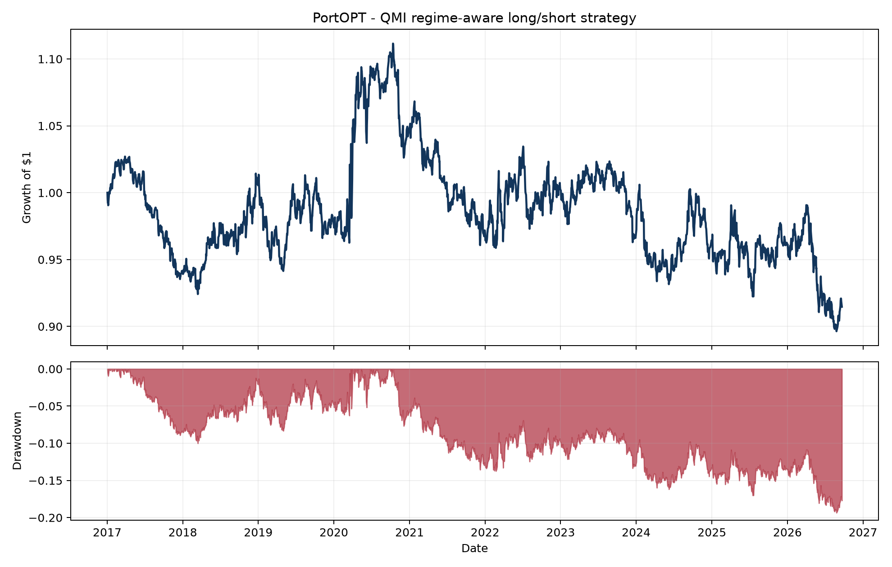

# PortOPT

PortOPT is an end-to-end research pipeline for a monthly rebalanced, Euro-area equity
long/short portfolio. It combines a public-data Quant Macro Indicator (QMI) with
cross-sectional factor scores, then solves a constrained mean-variance allocation for an
initial capital base of $1,000,000.

The project is designed for reproducible research: data downloads are cached, signals are
formed only from information available at the rebalance date, trades occur after signal
formation, and every portfolio constraint is tested.



## Strategy

The public QMI proxy combines four Euro-area series:

- OECD business confidence, unemployment and inflation series distributed through FRED;
- the ECB deposit facility rate downloaded directly from the ECB Data Portal.

Every monthly macro observation is delayed by two months before it can enter the model.
Expanding normalization prevents future observations from changing historical QMI values.
The sign of the QMI level and its monthly change defines four regimes:

| QMI level | Direction | Regime |
|---|---|---|
| Positive | Rising | Expansion |
| Positive | Falling | Slowdown |
| Negative | Falling | Contraction |
| Negative | Rising | Recovery |

The equity universe contains 36 liquid EUR listings across banks, insurance, industrials,
technology, consumer, healthcare, materials, energy, utilities and telecom. The factor model
uses only adjusted price histories so every feature is reproducible without a paid fundamental
database:

- momentum: 12-month return excluding the most recent month;
- growth: medium-term return acceleration;
- quality: return consistency and downside-risk resilience;
- low risk: a blend of realized volatility and market beta;
- value: long-horizon residual price mean reversion, explicitly a price-based value proxy.

Regime-specific tilts change the factor mix. The optimizer then maximizes factor score while
penalizing covariance risk and turnover.

## Portfolio constraints

The default configuration enforces:

- gross exposure no greater than 100%;
- absolute net exposure no greater than 5%;
- individual positions no greater than 7.5%;
- sector gross exposure no greater than 30%;
- absolute sector net exposure no greater than 10%;
- long positions only in the top 30% and short positions only in the bottom 30% of scores.

The backtest includes 10 bps of transaction costs per unit of turnover and a 50 bps annualized
short-borrow charge. Weights are decided at each month-end and become active after the next
trading close, preventing same-close execution assumptions.

## Quick start

```bash
python -m venv .venv
source .venv/bin/activate
python -m pip install -e ".[dev]"
portopt --config configs/default.yaml --refresh
```

Generated files appear in `reports/`:

- `metrics.json` - headline performance and exposure statistics;
- `equity_curve.csv` and `daily_returns.csv` - portfolio history;
- `weights.csv` and `turnover.csv` - a full allocation audit trail;
- `regimes.csv` and `gmm_diagnostic.csv` - macro-state diagnostics;
- `performance.png` - equity and drawdown chart.

Run the quality gate with:

```bash
make lint
make test
```

## Reference run

The checked reference run covers 2,488 trading observations after the warm-up period. With the
default constraints and costs, it ends at $914,068 from $1,000,000, with -0.91% CAGR, 6.95%
annualized volatility, -0.10 Sharpe ratio and -19.35% maximum drawdown. Average gross exposure
is 88.2% and average net exposure is 4.2%.

These results are deliberately reported without in-sample parameter optimization. A negative
reference result is informative: it establishes an honest baseline and avoids selecting factor
weights solely because they fit this sample.

## Data sources and use

- [ECB Data Portal API](https://data.ecb.europa.eu/help/api/data) for the deposit facility rate;
- [FRED](https://fred.stlouisfed.org/) for OECD/Euro-area macro series distribution;
- [yfinance](https://github.com/ranaroussi/yfinance) for research access to Yahoo Finance adjusted
  price history.

`yfinance` is open-source, but the downloaded Yahoo data is subject to Yahoo's terms and is
intended here for research and educational use. Cached raw data is excluded from version
control. Users requiring production or commercial use should replace the provider adapter with
a licensed feed.

## Research limitations

- The static universe creates survivorship bias; a production backtest needs point-in-time index
  membership and delisting returns.
- Price-only quality and value signals are proxies, not substitutes for point-in-time accounting
  fundamentals.
- Macro releases are conservatively delayed but the source files do not provide vintage data;
  a real-time vintage database is required to eliminate revision bias completely.
- Borrow availability, dividends on short positions, withholding taxes, slippage and market impact
  are simplified.
- This repository is research software, not investment advice.

## Project layout

```text
configs/default.yaml       strategy, risk and cost assumptions
data/universe.csv          EUR equity universe and sector map
src/portopt/data.py        market-data adapter and cache
src/portopt/macro.py       public QMI construction
src/portopt/factors.py     point-in-time factor engine
src/portopt/regimes.py     rule-based regimes, OU and GMM diagnostics
src/portopt/optimizer.py   constrained SLSQP allocation
src/portopt/backtest.py    execution and accounting engine
src/portopt/reporting.py   reproducible research outputs
tests/                     exposure, regime and look-ahead tests
```
